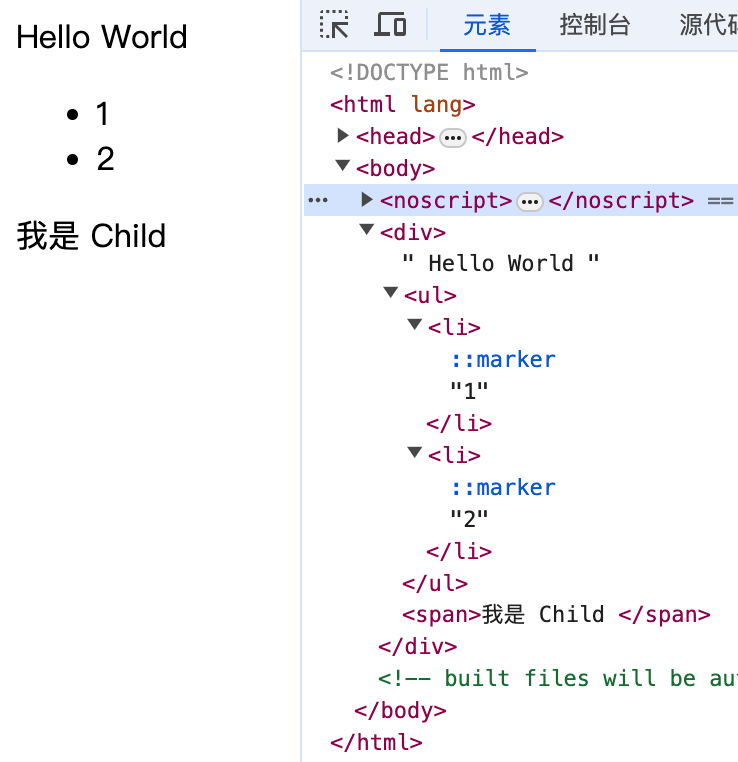
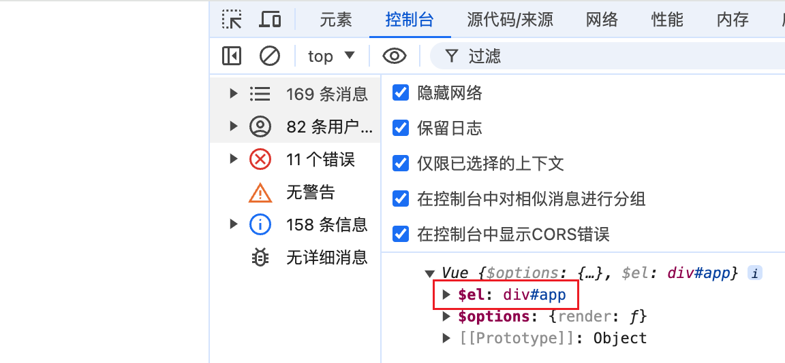

🔥 手写小型 vue 学习首次渲染流程

# 0.项目准备

本篇教程是准备手写一个 小型vue2 的教程来学习 vue2 的渲染流程。

我们先用 vue脚手架 搭建一个项目，项目结构和正常项目保持一致。

```js
// main.js
import Vue from "vue";
import App from "./App.vue"; 

function render(h){
    return h(App);
}  
new Vue({
    render
}).$mount("#app");
==========================================
// App.vue
<template>
  <div>
    Hello World
    <ul>
      <li>1</li>
      <li>2</li>
    </ul>
    <Child />
  </div>
</template> 
<script>
import Child from "./Child.vue";
export default {
  components: { Child },
};
</script>
==========================================
// Child.vue
<template>
  <span>我是 Child </span>
</template>
```


这里的例子虽然比较简单，但是也涉及到子节点、组件、文本节点渲染的知识。用来学习 vue渲染 流程可能是够的。

项目运行起来，浏览器中已经渲染出 DOM元素了。

接下来我们的目标就是不借助 Vue来 实现上面浏览器渲染的效果。

# 1. 从 new Vue() 到 updateComponent 函数

updateComponent函数是 Vue中挂载的核心方法。

运行到updateComponent说明我们已经准备就绪，准备开始挂载了。

## 1.1 创建vue构造函数

我们新建src/my-vue文件，用来编写小型 vue。

```js
new Vue({
    render
}).$mount("#app");
```
由上很容易知晓 Vue 是一个类，可以使用 new 关键字来生成一个实例。

所以很容易实现 Vue 构造函数。

<details>
<summary>展开查看</summary>
<pre><code>
class Vue {
    constructor(){
      // 初始化有一些方法
    }    
}
</code></pre>
</details> 

## 1.2 将构造函数参数存在$options上

构造函数参数在 vue中 被称作选项。

方便生成实例后调用方便，将选项都存在$options上。

<details>
<summary>展开查看</summary>
<pre> 
```js
export default class Vue {
    $options
    constructor(options){
        // 初始化有一些方法
        this.$options = options;
    }    
} 
```
</pre>
</details> 

## 1.3 实现实例方法$mount

## 1.3.1 第一步：传入挂载的节点属性如 id 获取真实 DOM。

<details>
<summary>展开查看</summary>
<pre><code>
class Vue{
  $mount(name){
    // 1. 获取真实 DOM
    const mountNode = document.querySelector(name);
  }
} 
</code></pre>
</details> 

## 1.3.2 第二步：调用mountComponent

mountComponent 方法用来设置```vm.$el```。
 
<details>
<summary>展开查看</summary>
<pre><code>
import mountComponent from "./mountComponent";
class Vue{
  $mount(name){
    // 1. 获取真实 DOM
    const mountNode = document.querySelector(name);
    mountComponent(this,mountNode);
  }
} 
// mountComponent.js
export default function mountComponent(vm, mountNode){
    vm.$el = mountNode;
}
</code></pre>
</details> 



我们此时打印出 vm，可以看到vm.$el指向挂载的节点。

## 1.4 实现 Watcher 并调用

Watcher在初始化时执行一次回调函数。

也就是执行挂载的函数。

那么为什么要特地搞一个 Watcher来执行这个函数呢？直接执行不就得了。

其实这个 Watcher是实现响应式的重要函数。我们这里只实现首次渲染的逻辑，所以先不重点描述。

<details>
<summary>展开查看</summary>
<pre><code>
// Watcher.js
export default class Watcher{
    cb;
    constructor(cb){
        this.cb = cb

        this.cb();
    }
}
// mountComponent.js
import Watcher from "./Watcher";

export default function mountComponent(vm, mountNode){
    vm.$el = mountNode;

    new Watcher(function(){console.log("callback执行")})
}
</code></pre>
</details> 

## 1.5 实现updateComponent

上节我们说到 Watcher在实例化的时候会执行一个 callback。

这个 callback 执行的就是updateComponent。

updateComponent执行的内容我们下节揭晓。

<details>
<summary>展开查看</summary>
<pre><code>
import Watcher from "./Watcher";

export default function mountComponent(vm, mountNode){
    vm.$el = mountNode;

    function updateComponent(){
        console.log("updateComponent执行")
    }

    new Watcher(updateComponent)
}
</code></pre>
</details> 

## 1.6 流程图

这节我们实现了$mount方法。

 .png>)


# 2. 实现vm._render

上节我们说到了执行 updateComponent。

updateComponent实际上就是调用的实际的更新方法，但是在说这个方法之前。

我们先关注一下 vm._render 方法。

因为在 updateComponent 内部就是调用 vm._render 先获取需要渲染的虚拟节点。

vue是一个基于虚拟节点的前端框架，渲染的过程就是将虚拟节点变成真实 DOM元素并挂载到页面上的过程。

## 2.1. vm._render实际上调用了什么？

<details>
<summary>展开查看</summary>
<pre><code>
export default class Vue {
    // 省略
    _render(){
        const { render } = vm.$options.render;
        render.call(vm, createElement);
    }
}
</code></pre>
</details> 

可以看到实际上调用的就是 实例化时传入的render函数。

然后将 createElement 函数传递过去。

这个 createElement 函数实际上就是生成虚拟 DOM的函数。


```js
function render(h){
    return h(App);
} 
```

所以createElement也就是入口文件的那个 h 函数，将 App.vue 包裹。

## 2.2 .vue文件是什么？

那么这个 App.vue 是什么呢？

我们可以将其打印出来。

我们可以看出打印的就是一个对象，包括 2 个属性：components 和 render。

webpack+vue-loader+vue-compiler预编译时会将 vue文件变成一个对象，并将模版部分变成一个render函数放在该对象上。

执行对象上的 render函数 就可以获取需要的 vnode。

但是我们这次需要实现自己的 createElement 用来获取 vnode。

所以我们模拟生成 App.js 和 Child.js 用来模拟 App.vue 和 Child.vue。

<details>
<summary>展开查看</summary>
<pre>
<code>
// App.js
import Child from './Child';
export default {
    render(h){  
        const _vm = this;
        return h("div", 
            [
                _vm._v(" Hello World "), 
                h("ul", [h("li", [_vm._v("1")]), h("li", [_vm._v("2")])]),
                h("Child")
            ]
        )
    },
    component:{
        Child
    }
}
// Child.js
export default {
    render(h) {
        const vm = this;
        return h("span", [vm._v("我是 Child ")]) 
    }
}
</code>
</pre>
</details> 

## 2.3 createElement实现

createElement的作用是生成vnode。

### 2.3.1 生成 VNode构造函数

定义 VNode构造函数规范化 vnode。

```js
export default class VNode {
    tag
    data
    children
    text
    constructor(tag,data,children){
        this.tag=tag;
        this.data=data;
        this.children=children;
        this.text=text;
    }
}
```

tag、data、children、text分别表示vnode的 渲染时将创建的 DOM 节点类型、虚拟节点相关的所有属性和特征、虚拟节点的子节点列表、存储虚拟节点的文本内容。

通常如果一个节点是只有一个 text，通常这是一个文字属性。

### 2.3.2 vm._v

我们可以看到模版编译将文字变成了 vm._v。

那么 vm._v 是干嘛用的呢？

```js
_v(val){
  new VNode(undefined, undefined, undefined, String(val))
}
```

可以看到，_v创建的 vnode只有一个 text属性。

表示_v的功能是创建一个文字类型的虚拟节点。

### 2.3.3 _render 改造

因为我们需要在 createElement函数内部使用 vm进行一些逻辑判断，所以修改一下_render方法来确保 vm的正确传递。

```js
import createElement from "./createElement";

_render(){
  const { render } = vm.$options.render;
  render.call(vm, (...arg)=>createElement(vm,...arg));
}
```
### 2.3.4 createElement

```js
export default function createElement(vm,tag,data,children){
    // 兼容 data、children参数
    if(Array.isArray(data)){
        data = undefined;
        children = data;
    }
    let vnode,Ctor;  
    if(isReservedTag(tag)){
        vnode = new VNode(tag,data,children);
    }else if(Ctor = vm.$options.components?.tag){
        vnode = createComponent(Ctor);
    } 
    return vnode;
}
```

第一步：先兼容 data和 children的数据。

然后判断是普通还是组件，如果是普通直接返回 vnode。

如果是组件，调用 createComponent 返回组件 vnode。

### 2.3.5 createComponent

